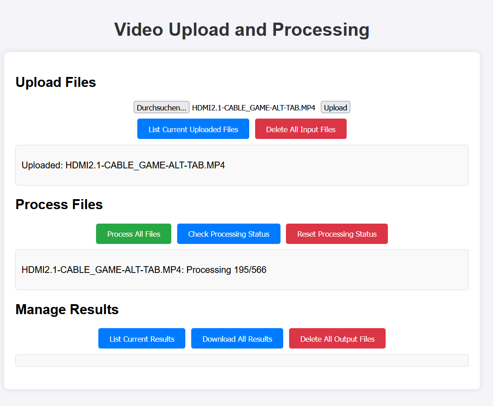

# media-processing-tool

Tools to process videos using a web application. Right now a simple detection model from tensorflow hub is used to process the videos.



## Prerequisites

- Python 3.7 or higher (only for backend/frontend/server tool)
- docker and docker-compose installed

**Clone the repository (on each system):**
   ```shell
   https://github.com/TimoIllusion/media-processing-tool.git
   cd media-processing-tool
   ```

## Full-Stack Tool

Javascript based frontend, flask backend, all in docker-compose, no client-side code. User just has to access the website.

**Bring up:**
```shell
cd full-stack-js
docker compose up -d --build
```

Go to `http://<your_host>:3000` to access the web interface.

**Shutdown:**
```shell
docker compose down
```

## Backend/Frontend/Server Tool

Flask based backend/frontend, client-side upload.

### Installation

Configure the ``config.py`` files in each dir as well as the docker compose file in ``storage``.

1. **Create virtual env for system backend:**
   ```shell
   cd backend
   python -m venv .env 
   source .env/bin/activate  # On Windows, use `.env\Scripts\activate`
   pip install -r requirements.txt
   cd ..
   ```

2. **Ensure MinIO is running on localhost or separate system:**

   You can run MinIO using Docker:
   ```shell
   cd storage
   docker-compose up -d
   cd ..
   ```

3. **Create virtual env for frontend on frontend system**
   ```shell
   cd frontend
   python -m venv .env 
   source .env/bin/activate  # On Windows, use `.env\Scripts\activate`
   pip install -r requirements.txt
   cd ..
   ```

### Usage

1. **Start the Server and Client application:**

   On system 1 (server):
   ```shell
   cd backend
   source .env/bin/activate  # On Windows, use `.env\Scripts\activate`
   python app.py
   cd .. # if on same system
   ```

   On system 2 (client), can be the same system:
   ```shell
   cd frontend
   source .env/bin/activate  # On Windows, use `.env\Scripts\activate`
   python app.py
   ```

2. **Access the application:**

   Open a web browser and navigate to `http://<YOUR_FRONTEND_IP_OR_HOSTNAME>:5000/` to access the web interface.

3. **Upload Videos:**

   - Go to the "Upload Files" section.
   - Select multiple video files to upload.
   - Click the "Upload" button to upload the videos to MinIO storage.

4. **Process Videos:**

   - Go to the "Process Files" section.
   - Click the "Process All Files" button to process all uploaded videos.
   - The processing status will be displayed for each video.

5. **Manage Results:**

   - Go to the "Manage Results" section.
   - List the current uploaded files by clicking "List Current Uploaded Files".
   - List the processed results by clicking "List Current Results".
   - Download all processed results as a zip file by clicking "Download All Results".
   - Delete all input files from MinIO by clicking "Delete All Input Files".
   - Delete all output files from MinIO by clicking "Delete All Output Files".

6. **Shutdown:**

   - ``Ctrl + C`` to close the apps in terminal
   - Go to storage dir and run ``docker compose down``

## License

This project is licensed under the MIT License - see the LICENSE file for details.
