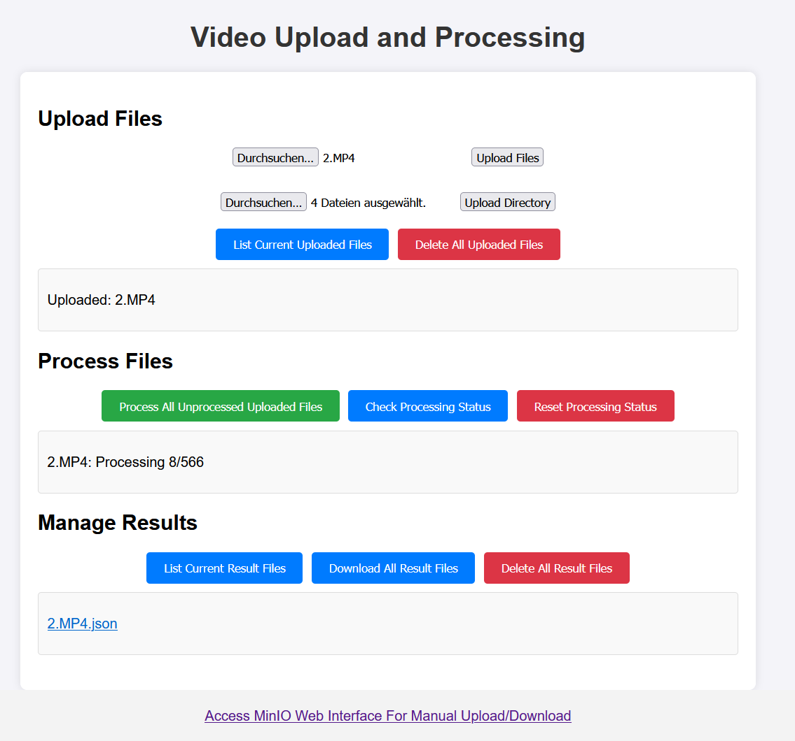

# media-processing-tool

Tools to process videos using a web application. Flask/JavaScript based frontend, flask backend, all in docker-compose, no client-side code. User just has to access the website. 

Currently a simple detection model from tensorflow hub is used to process the videos.



## Prerequisites

- Python 3.7 or higher (only for backend/frontend/server tool)
- docker with docker-compose
- git

## Setup

**Clone the repository on the system to host the processing(local system for testing or server for deployment):**
   ```shell
   https://github.com/TimoIllusion/media-processing-tool.git
   cd media-processing-tool
   ```

**Bring up frontend, backend and object storage:**
```shell
docker compose up -d --build
```

Go to `http://<YOUR_FRONTEND_IP_OR_HOSTNAME>:5000` to access the web interface. Default is `http://localhost:5000`. See [Usage](#usage) for more details.

**Shutdown full stack:**
```shell
docker compose down
```

## Usage

1. **Access the application:**

   Open a web browser and navigate to `http://<YOUR_FRONTEND_IP_OR_HOSTNAME>:5000/` to access the web interface.

2. **Upload Videos:**

   - List the current uploaded files by clicking "List Current Uploaded Files".
   - Remove previous data: Delete all input files from MinIO by clicking "Delete All Uploaded Files".
   - Go to the "Upload Files" section and select multiple video files to upload.
   - Click the "Upload" button to upload the videos to MinIO storage.

   > **Note:** Alternatively, the "Upload Directory" button can be used to upload all videos from a directory.

3. **Process Videos:**

   - Go to the "Process Files" section.
   - Click the "Process All Unprocessed Uploaded Files" button to process all uploaded videos.
   - The current processing status will be displayed for each video when clicking on "Check Processing Status".

4. **Manage Results:**

   - Go to the "Manage Results" section.
   - List the processed results by clicking "List Current Results Files".
   - Download all processed results as a zip file by clicking "Download All Result Files".
   - Delete all output files from MinIO by clicking "Delete All Result Files".

## License

This project is licensed under the MIT License - see the LICENSE file for details.
